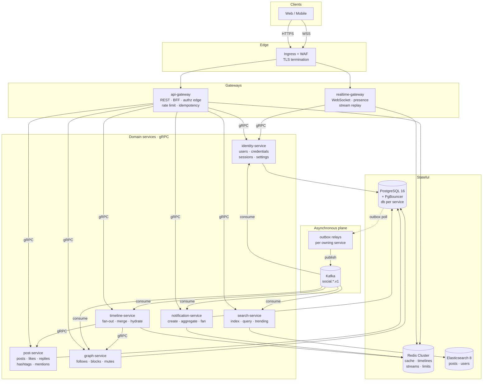
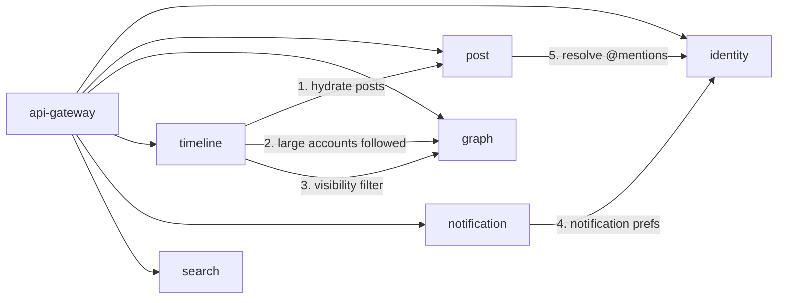
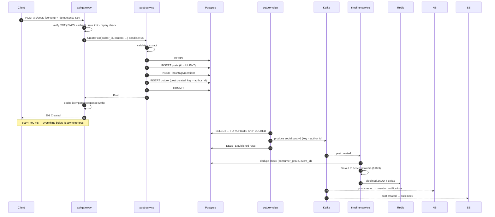
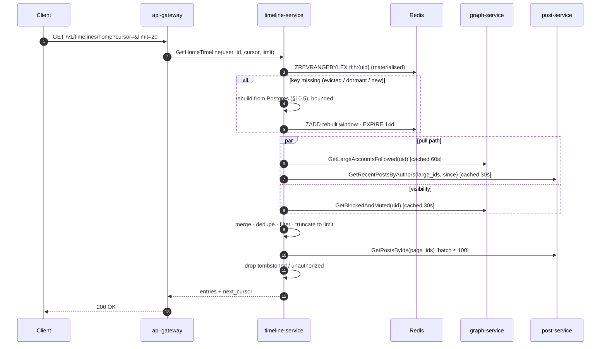
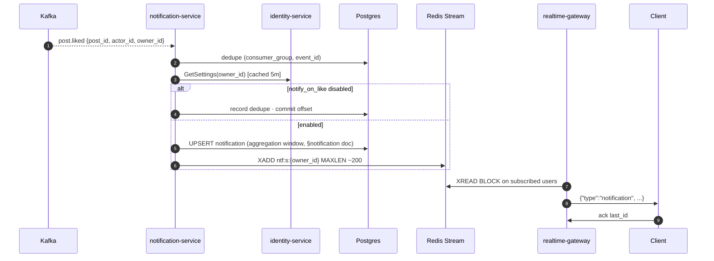

# System Design — Social Backend

**Version:** 2.0
**Status:** Approved for implementation
**Supersedes:** `twitter-linkedin-distributed-backend-design.md` (v1.0)
**Review that produced this:** `docs/00-review/architecture-review-v1.md`

---

## Table of contents

1. [Purpose and design point](#1-purpose-and-design-point)
2. [Goals and non-goals](#2-goals-and-non-goals)
3. [Capacity model](#3-capacity-model)
4. [Architecture overview](#4-architecture-overview)
5. [Component inventory](#5-component-inventory)
6. [Consistency model](#6-consistency-model)
7. [Core flows](#7-core-flows)
8. [Data architecture](#8-data-architecture)
9. [Event architecture](#9-event-architecture)
10. [The timeline problem](#10-the-timeline-problem)
11. [Authorization model](#11-authorization-model)
12. [Scale-out path](#12-scale-out-path)
13. [Risks and open questions](#13-risks-and-open-questions)

Cross-cutting concerns are specified separately — see [`docs/03-cross-cutting/`](../03-cross-cutting/).
Per-component detail is in [`docs/02-components/`](../02-components/).
Decisions and their alternatives are in [`decisions.md`](./decisions.md).

---

## 1. Purpose and design point

A distributed backend for a public microblogging product: accounts, posts, replies, reposts, likes, an asymmetric follow graph, a home timeline, notifications with real-time delivery, and search.

Everything in this document is sized against one explicit **design point**. Numbers that are not derived from it are marked as assumptions.

| Parameter | Value | Basis |
|---|---|---|
| Registered users | 1,000,000 | Stated target |
| Daily active users (DAU) | 200,000 | 20% DAU/MAU — typical for a mid-size social product |
| Peak concurrency factor | 5× average | Diurnal traffic, single dominant timezone |
| API calls per DAU per day | 60 | ~4 sessions × 15 calls; read-dominated (timeline scroll) |
| Posts per DAU per day | 0.5 | 100K posts/day; ~10% of users post daily |
| Likes per DAU per day | 10 | 2M likes/day |
| Follows per DAU per day | 1 | 200K follow events/day |
| Follow edges | 100,000,000 | Avg 100 followers/user; power-law distributed |
| Read:write ratio | ~40:1 | Timeline reads dominate |

> **Note on the v1 targets.** v1 stated "10K RPS sustained" alongside "1M users". Those are inconsistent by roughly an order of magnitude — 10K RPS across 1M registered users implies each user issuing ~1 request/second, continuously. The design point above yields **~140 RPS average and ~700 RPS peak**, and this document sizes for **1,500 RPS peak** (2× headroom). §12 gives the path to 10K RPS; nothing in this design blocks it, but building for it now would be a ~10× cost error.

### Service level objectives

SLOs, error budgets, and burn-rate alerting are specified in [`observability-and-slo.md`](../03-cross-cutting/observability-and-slo.md). Summary:

| SLI | Objective | Window |
|---|---|---|
| API availability (non-5xx / total, edge-measured) | 99.9% | 30d rolling |
| Timeline read latency, p99 | < 250 ms | 30d rolling |
| Post create latency, p99 | < 400 ms | 30d rolling |
| Fan-out freshness (post visible in follower timeline), p99 | < 5 s | 30d rolling |
| Notification delivery to connected client, p99 | < 3 s | 30d rolling |
| Search index freshness, p99 | < 30 s | 30d rolling |

Fan-out freshness and search freshness are **eventual-consistency budgets**, and they are user-visible product decisions, not implementation details. They are stated as SLOs so they can be measured and defended.

---

## 2. Goals and non-goals

### Goals

1. **Correct under partial failure.** Every asynchronous path is at-least-once with idempotent handlers; every cache is rebuildable from a durable source; every degraded mode is explicit, tested, and observable.
2. **Operable by a small team.** One deployment mechanism, one observability stack, runbooks attached to alerts, no component that requires specialist knowledge to restart.
3. **Independently deployable services** with owned data, communicating by typed contracts (gRPC for request/response, Protobuf events over Kafka for propagation).
4. **Private by default where the user asked for it.** Visibility is enforced at the data-owning service, not only at the edge.
5. **Cost-proportionate.** Start at the design point; document the scale-out path rather than pre-building it.

### Non-goals (v2)

| Non-goal | Rationale | Seam left in the design |
|---|---|---|
| Media upload/processing | Large, separable problem | `media_refs` are opaque IDs resolved by a future media service; §8.3 defines the contract |
| Direct messaging | Different data model (symmetric, E2E-adjacent) | Separate service, separate topic namespace |
| ML ranking / recommendations | Timeline is reverse-chronological in v2 | §10.6 defines the ranking insertion point |
| Multi-region active-active | Not justified at 200K DAU | §12.4 sketches the path; all IDs are already globally unique |
| Automated content moderation | Policy problem before it is an engineering problem | §11.4 defines report/enforcement hooks and a visibility kill-switch |
| Ads, monetisation, analytics warehouse | Out of scope | `social.*` topics are the CDC source when needed |

### Explicitly *in* scope that v1 omitted

Blocking and muting, private accounts, account deletion and erasure, email verification and password reset, idempotent writes, and abuse rate controls. Each of these has architectural reach that makes retrofitting expensive — see review findings F1, F4, F5, F6, A4.

---

## 3. Capacity model

All figures derived from §1. Peak = 5× average unless noted.

### 3.1 Request volume

| Path | Avg RPS | Peak RPS | Notes |
|---|---|---|---|
| Total API | 139 | 695 | 200K × 60 / 86,400 |
| Timeline reads | ~90 | ~450 | ~65% of traffic |
| Post create | 1.2 | 6 | 100K/day |
| Like/unlike | 23 | 116 | 2M/day |
| Follow/unfollow | 2.3 | 12 | 200K/day |
| Search | 7 | 35 | ~5% of traffic |

**Design for 1,500 RPS peak.** Two replicas of the API gateway at ~800 RPS each is comfortable for Node.js doing I/O aggregation; run three for failure tolerance.

### 3.2 Fan-out amplification

This is the number that determines whether the architecture works.

```
Naive fan-out  = posts/day × avg_followers
               = 100,000 × 100
               = 10,000,000 timeline writes/day = 116/s avg, 580/s peak
```

That is already tractable, but it is dominated by writes to timelines nobody will read. We fan out only to **followers with a materialised timeline** — which, because timeline keys carry a 14-day TTL refreshed on read, is exactly the set of recently active followers (§10.3).

```
Effective fan-out = 100,000 posts × (100 followers × ~20% active)
                  = 2,000,000 ZADDs/day = 23/s avg, 116/s peak
```

Redis handles >100K ops/s per node. Fan-out is **three orders of magnitude** below the limit at the design point. The constraint is not throughput — it is **tail latency for large accounts**:

| Author's active followers | ZADDs | Pipelined batches (500) | Wall time @ 1 ms RTT |
|---|---|---|---|
| 100 (p50) | 100 | 1 | ~2 ms |
| 5,000 (p99) | 5,000 | 10 | ~30 ms |
| 50,000 | 50,000 | 100 | ~250 ms |
| 500,000 (large account) | 500,000 | 1,000 | ~3 s |

Fan-out is asynchronous, so wall time spends the **freshness** budget (5 s p99), not the request budget. The 3-second figure for a 500K-follower account consumes most of it, and a burst of such posts would queue. Hence the large-account threshold in §10.4 — set at **50,000 followers**, which the table shows is where a single post starts to cost a meaningful fraction of one consumer's second.

### 3.3 Redis memory

The dominant consumer is home timelines.

```
Materialised timelines  = 200,000 active users (14-day window)
Entries per timeline    = 400 (≈ 2–3 days of a 100-follow feed; deeper reads fall through to §10.5)
Member encoding         = base64url(UUIDv7) = 22 chars → Redis embstr
Per-entry cost          ≈ 90 B (skiplist node + dict entry + sds)

Timeline memory = 200,000 × 400 × 90 B ≈ 7.2 GB
```

| Keyspace | Estimate | Policy |
|---|---|---|
| Home timelines `tl:h:{uid}` | 7.2 GB | TTL 14d, refreshed on read; **evictable** |
| User profile cache `u:p:{uid}` | 200K × 400 B ≈ 80 MB | TTL 1h |
| Post cache `p:{pid}` | 500K hot × 600 B ≈ 300 MB | TTL 30m |
| Notification streams `ntf:s:{uid}` | ~1 GB expected, **10 GB worst case** | `MAXLEN ~ 200`, TTL 30d — **see risk R3** |
| Rate limit / idempotency / sessions | < 500 MB | short TTL |
| **Total** | **~9 GB expected, ~18 GB worst case** | |

> The notification figure needs care: `MAXLEN ~ 200` is a *cap*, not a fill level. Entries carry only an ID, type, and timestamp (~120 B including stream overhead), and the median user accumulates single-digit notifications per month, not 200. Expected steady state is ~1 GB; the 10 GB line is the arithmetic bound if every active user simultaneously held a full stream, which will not happen. Provisioning uses the bound, forecasting uses the expectation — and the metric `redis_memory_by_keyspace` tells us which one reality is tracking.

Provision **3 masters × 12 GB + 3 replicas** (36 GB usable), `maxmemory-policy volatile-lru`. Every evictable keyspace carries a TTL; nothing without a TTL may be stored in this cluster. Timeline eviction is *safe by construction* — §10.5 rebuilds from Postgres.

> Contrast with v1: `timeline:{user_id}`, 1,000 entries, **1M users, no TTL**, 36-char members ≈ **140 GB** against an unsized 6-node cluster. The fix is not a bigger cluster; it is making timelines evictable, active-only, and shorter.

### 3.4 Postgres growth

| Table | Rows/year | Size/year (incl. indexes) | Strategy |
|---|---|---|---|
| `users` | +200K | ~1 GB total | Single table |
| `posts` | 36.5M | ~18 GB | Monthly `RANGE` partition on `created_at` from day one |
| `likes` | **730M** | ~55 GB | `HASH` partition on `post_id`, 32 partitions, from day one |
| `follows` | 100M (stock) | ~14 GB | Single table; sharding path in §12.2 |
| `notifications` | 250M | ~35 GB | Monthly `RANGE` partition; **drop partitions older than 90 days** |
| `outbox` | transient | < 1 GB | Deleted on publish; hourly vacuum |
| `processed_events` | transient | < 5 GB | Daily `RANGE` partition, drop after 7 days |

Total steady state ≈ **125 GB/year**, well within a single primary + replica. `likes` and `notifications` are the tables that make partitioning non-optional (review C2).

### 3.5 Kafka

```
Events/day = 100K post.created + 2M post.liked + 200K graph
           + replies/reposts/user events ≈ 2.5M/day
           = 29/s avg, 145/s peak
Message size ≈ 400 B (Protobuf) → 1 GB/day → ×3 replicas × 7d = 21 GB
```

Three brokers, `replication.factor=3`, `min.insync.replicas=2`, `acks=all`. Partition counts in §9.2. Kafka is provisioned for **durability and independent consumer scaling**, not throughput — at 145 msg/s peak, throughput is a non-issue and should not be used to justify complexity.

### 3.6 Connections — the constraint that actually bites

```
8 services × 3 replicas × pool of 10 = 240 direct connections
Postgres max_connections (typical managed default) = 100–200
```

This fails on the first realistic deploy (review C7). Therefore:

- **PgBouncer in transaction pooling mode is mandatory**, sized `default_pool_size=20` per database.
- Application pools are **small**: `max: 5` per replica.
- Transaction-pooling constraints are binding on application code: no session-level state, no `SET LOCAL` outside a transaction, no server-side prepared statements without `protocol=simple` or PgBouncer ≥ 1.21 prepared-statement support. This is a **code constraint**, documented in [`data-management.md`](../03-cross-cutting/data-management.md).

---

## 4. Architecture overview



### 4.1 Communication rules

| From | To | Mechanism | Rule |
|---|---|---|---|
| Client | Gateway | REST/JSON, WSS | Public contract, versioned, OpenAPI-described |
| Gateway | Domain service | gRPC unary | Deadline propagated from the inbound request |
| Domain service | Domain service | gRPC unary | **Only along the dependency DAG in §5.2.** No cycles. |
| Domain service | Domain service | Kafka event | Default for anything not needed to answer the current request |
| Service | Its own database | SQL via PgBouncer | **A service's tables are private.** No cross-service SQL, enforced by DB roles. |

**The governing rule:** if service A needs data from service B to answer a request *now*, it calls B over gRPC and inherits B's availability. If A needs to *react* to something in B, it consumes B's events and does not. Every synchronous edge is a coupling that must be justified; §5.2 lists all of them and there are only five.

---

## 5. Component inventory

### 5.1 Deployables

| Component | Kind | Owns | Scales on | Detail |
|---|---|---|---|---|
| `api-gateway` | HTTP | nothing (stateless) | RPS | [doc](../02-components/api-gateway.md) |
| `realtime-gateway` | WebSocket | connection registry (Redis) | concurrent connections | [doc](../02-components/realtime-gateway.md) |
| `identity-service` | gRPC | `users`, `credentials`, `sessions`, `user_settings`, `email_tokens` | RPS | [doc](../02-components/identity-service.md) |
| `post-service` | gRPC + consumer | `posts`, `likes`, `hashtags`, `mentions` | RPS / lag | [doc](../02-components/post-service.md) |
| `graph-service` | gRPC + consumer | `follows`, `blocks`, `mutes` | RPS / lag | [doc](../02-components/graph-service.md) |
| `timeline-service` | gRPC + consumer | Redis timelines (derived) | **consumer lag** | [doc](../02-components/timeline-service.md) |
| `notification-service` | gRPC + consumer | `notifications` | **consumer lag** | [doc](../02-components/notification-service.md) |
| `search-service` | gRPC + consumer | ES indices (derived) | **consumer lag** | [doc](../02-components/search-service.md) |
| `*-outbox-relay` | worker | nothing | outbox depth | §9.4 |
| `jobs` | CronJob set | nothing | n/a | §5.3 |

Deployables that consume Kafka scale on **lag via KEDA**, not CPU (review H2). Effective parallelism is capped at the partition count.

`identity-service` deliberately merges authentication and profile. At this scale they share a transaction boundary (registration writes credentials and profile atomically) and splitting them would introduce a distributed transaction for no benefit. The seam is documented in its component doc.

### 5.2 The synchronous dependency DAG

There are exactly five service-to-service gRPC edges. Every one is justified; anything not on this list must be an event.



| # | Edge | Why synchronous | Failure behaviour |
|---|---|---|---|
| 1 | timeline → post | Timeline stores IDs; the response needs post bodies | Circuit-break → serve from post cache; omit unhydratable IDs |
| 2 | timeline → graph | The pull path needs the large accounts this user follows | Cached 60 s; on failure serve materialised-only (degraded, flagged) |
| 3 | timeline → graph | Block/mute filter must be current — a stale block leaks content | Cached 30 s; **on failure fail closed** for blocks |
| 4 | notification → identity | Preferences gate creation | Cached 5 min; on failure default to *enabled* (a missed notification is worse than an extra one; the user can still mute) |
| 5 | post → identity | `@username` → user_id at write time | On failure, store the mention unresolved and repair via a job |

Edges 1–3 are on the hottest read path, so all three are cached and circuit-broken. Edge 3 is the only one that **fails closed** — this is a deliberate availability-vs-privacy tradeoff, recorded in ADR-0015.

### 5.3 Scheduled jobs

| Job | Cadence | Purpose |
|---|---|---|
| `outbox-vacuum` | hourly | Delete published outbox rows older than 1 h |
| `dedupe-prune` | daily | Drop `processed_events` partitions older than 7 d |
| `counter-reconcile` | daily | Recompute follower/following/post/like counts from source tables; emit drift metric; correct |
| `session-sweep` | hourly | Delete expired sessions and email tokens |
| `notification-retention` | daily | Drop `notifications` partitions older than 90 d |
| `trending-compute` | 5 min | Roll Redis hashtag buckets into the trending set |
| `erasure-worker` | continuous | Process account-deletion requests (§8.6) |
| `es-reindex` | on demand | Alias-swap reindex (§ search component doc) |
| `mention-repair` | 15 min | Resolve mentions left unresolved by edge 5 |

`counter-reconcile` is what makes denormalised counters safe: they are an optimisation with a defined, monitored drift bound, not a source of truth.

---

## 6. Consistency model

The most important table in this document. Every field a client can observe is classified.

| Data | Consistency | Bound | Mechanism |
|---|---|---|---|
| A post you just created | **Read-your-writes** | immediate | Create returns the persisted entity; client renders optimistically |
| Post body, author, timestamps | **Strong** | immediate | Single-row read from owning service |
| Like/unlike **by you** | **Read-your-writes** | immediate | `likes` row is the source of truth, returned in the response |
| Follow/unfollow **by you** | **Read-your-writes** | immediate | `follows` row committed before response |
| Timeline containing a new post | **Eventual** | p99 < 5 s | Kafka fan-out |
| `like_count`, `follower_count`, `post_count` | **Eventual, approximate** | p99 < 10 s, drift reconciled daily | Event-driven counters + `counter-reconcile` |
| Notifications | **Eventual** | p99 < 3 s to a connected client | Kafka → Postgres → Redis Stream |
| Search results | **Eventual** | p99 < 30 s | Kafka → bulk indexer |
| Block takes effect | **Strong on the read path** | immediate | Read-path filter reads graph with a 30 s cache; **cache invalidated synchronously on block** |
| Private-account visibility change | **Eventual for existing copies** | < 60 s | §11.3 — flip is fast on the read path, ES purge is async |
| Deleted post disappears | **Eventual** | < 5 s | Tombstone at hydration (§10.7); ES delete async |

Two rules follow, and they are binding on every client and every service:

1. **Counters are approximate.** No business logic branches on an exact counter value. The large-account threshold (§10.4) uses a counter, and it is explicitly tolerant of drift.
2. **Blocks are the exception.** Everywhere else eventual consistency is fine; a stale block leaks content to someone the user has explicitly excluded. Block state is force-invalidated on write and the read path fails closed.

---

## 7. Core flows

### 7.1 Create post



The write transaction commits **the entity and its outbox row atomically**. That single property is what makes the whole asynchronous plane trustworthy: there is no window in which a post exists without its event, or an event exists without its post.

### 7.2 Read home timeline



Budget for p99 < 250 ms: Redis ZSET read ~2 ms, the parallel gRPC block ~15 ms (cached), hydration ~20 ms, serialisation ~5 ms. The rebuild branch is the expensive case — §10.5 bounds it at ~120 ms and it is measured separately.

### 7.3 Notification delivery



Redis **Streams**, not pub/sub (review E5). Pub/sub drops messages for any user not connected at that instant and offers no replay; a stream gives at-least-once delivery, a per-connection cursor, and catch-up on reconnect via `last_seen_id`. Postgres remains the durable source; the stream is a delivery buffer.

---

## 8. Data architecture

### 8.1 Topology

One Postgres 16 cluster (primary + sync replica), **one database per service**, one role per service with no cross-database grants. This is logical isolation on shared infrastructure — an explicit cost decision (ADR-0005), with the physical-split path in §12.2. The boundary is enforced by grants, not convention, so it cannot erode silently (review C11).

```
postgres-primary
├── identity_db      ← identity-service role only
├── post_db          ← post-service role only
├── graph_db         ← graph-service role only
└── notification_db  ← notification-service role only
```

All traffic goes through PgBouncer (§3.6).

### 8.2 Conventions

| Concern | Rule |
|---|---|
| Primary keys | **UUIDv7** (`uuid` column). Time-ordered → sequential index inserts, and the ID *is* a valid pagination cursor (fixes C3 and E3 together) |
| Timestamps | `timestamptz`, always UTC, always DB-assigned (`now()`) — never client or app clocks |
| Money/counters | `bigint`, `CHECK (>= 0)`. No clamping (`GREATEST(x-1,0)` hides bugs — review C5) |
| Soft delete | `deleted_at timestamptz NULL`; every index on the table is `WHERE deleted_at IS NULL` |
| Enums | Postgres `text` + `CHECK`, not native enums (native enum changes take an `ACCESS EXCLUSIVE` lock) |
| Naming | `snake_case`, plural tables, `fk_`/`ix_`/`uq_` prefixes |
| Migrations | Expand/contract, forward-only, reviewed for lock class — [`data-management.md`](../03-cross-cutting/data-management.md) |

### 8.3 Ownership map

| Table | Owner | Notes |
|---|---|---|
| `users`, `credentials`, `sessions`, `user_settings`, `email_tokens` | identity | `credentials` split from `users` so password hashes are never in a profile `SELECT *` |
| `posts`, `likes`, `hashtags`, `post_hashtags`, `mentions` | post | `posts` monthly partitioned; `likes` hash-partitioned ×32 |
| `follows`, `blocks`, `mutes` | graph | |
| `notifications` | notification | monthly partitioned, 90-day retention |
| `outbox`, `processed_events` | *each service, locally* | Same DDL, deployed per database — no shared infrastructure table |

Idempotency keys are **Redis-only** (api-gateway §5), not a Postgres table. v1 specified a table; a durable store would be right if replay had to survive a total Redis loss, but the key TTL is 24 hours and the failure mode of losing them is a duplicate post on a retry that spans a Redis outage. Paying a synchronous Postgres write on every mutating request to close that window is the wrong trade, and the gateway owns no database in any case.

`media_refs` on `posts` is a `text[]` of opaque IDs, not URLs. This is the seam for a future media service and it closes the SSRF/abuse vector from review F11: the backend never dereferences a user-supplied URL.

### 8.4 Counters

Denormalised counters (`follower_count`, `following_count`, `post_count`, `like_count`, `reply_count`, `repost_count`) exist because computing them per read is unaffordable. They are maintained as follows — resolving the v1 contradiction in review C1:

1. The **relation row is the source of truth** (`likes`, `follows`). Inserts use `ON CONFLICT DO NOTHING`; the affected-row count tells the caller whether the state actually changed. This makes like/follow naturally idempotent with no extra machinery.
2. Counter updates are applied **only** by a Kafka consumer, inside the same transaction as its dedupe insert. There are no `IncrementFollowerCount` RPCs. Retries are safe because the dedupe row makes the handler idempotent.
3. Hot rows are avoided: `posts.like_count` is not updated per like. The consumer **accumulates deltas in memory over a 1-second window** and applies one `UPDATE ... SET like_count = like_count + :delta` per post per second. A post taking 1,000 likes/second costs one row update per second instead of a thousand serialised ones (review C4).
4. `counter-reconcile` recomputes from source nightly, emits `counter_drift` per counter, and corrects. Drift > 0.1% pages.

### 8.5 Caching

| Key | Type | TTL | Invalidation |
|---|---|---|---|
| `u:p:{uid}` | Hash | 1 h | Deleted on `user.updated` (consumer) and on write |
| `u:n:{username}` | String → uid | 1 h | Deleted on username change (both old and new) |
| `p:{pid}` | Hash | 30 m | Deleted on update/delete |
| `tl:h:{uid}` | ZSet | 14 d, refreshed on read | Evictable; rebuildable (§10.5) |
| `ntf:s:{uid}` | Stream | 30 d | `MAXLEN ~ 200` |
| `rl:{scope}:{subject}` | String | window | Expires |
| `idem:{key_hash}` | String | 24 h | Expires |
| `sess:{sha256(token)}` | Hash | = token TTL | Deleted on logout/revoke (token never in the key — review E4) |

**Cache-aside with delete-on-write** (never update-on-write: two concurrent writers can interleave a stale populate after a fresh update). Negative caching on 404s for 30 s to blunt enumeration scans. Single-flight per key on miss to prevent stampedes on hot posts.

### 8.6 Deletion and erasure

`DELETE /v1/users/me` starts a **staged erasure**, not a cascade of deletes (review A4):

| Stage | Timing | Action |
|---|---|---|
| 0 | immediate | `users.status = 'deactivated'`; all sessions revoked; account invisible to reads; `user.deactivated` published |
| 1 | immediate | ES documents deleted; timelines containing the user's posts filter them at hydration; notifications suppressed |
| 2 | 30 days | Grace period — the user may reactivate |
| 3 | day 30 | `erasure-worker` runs: PII columns overwritten with a tombstone; `credentials` deleted; posts either deleted or reassigned to a tombstone author per the user's choice; graph edges removed **in checkpointed batches** (up to millions of rows — this is a job, not an event handler; review D8) |
| 4 | day 30 | `user.erased` published as a **compaction tombstone** on `social.user.v1` |

Kafka retains events containing PII for 7 days. Rather than crypto-shredding (which requires per-user keys and complicates every consumer), the design keeps **PII out of event payloads**: events carry identifiers, and consumers that need profile fields fetch them. `social.user.v1` is the one exception and it is **log-compacted** with tombstone support, so erasure is expressible.

---

## 9. Event architecture

### 9.1 Envelope

Protobuf, registered in a schema registry, `BACKWARD_TRANSITIVE` compatibility enforced in CI by `buf breaking` (review D2).

```protobuf
message EventEnvelope {
  string  event_id       = 1;  // UUIDv7 — the idempotency key
  string  event_type     = 2;  // "post.created"
  string  aggregate_type = 3;  // "post"
  string  aggregate_id   = 4;
  uint32  schema_version = 5;
  google.protobuf.Timestamp occurred_at = 6;  // DB commit time, not wall clock
  string  correlation_id = 7;  // W3C traceparent
  string  producer       = 8;  // "post-service@1.4.2"
  google.protobuf.Any payload = 9;
}
```

Rules: additive changes only; never reuse a field number; never change a field's meaning; a new required semantic means a **new event type**, not a new version. `occurred_at` is the database commit timestamp, so ordering never depends on host clock skew across replicas.

### 9.2 Topics

| Topic | Partitions | Key | Retention | Producers | Consumer groups |
|---|---|---|---|---|---|
| `social.user.v1` | 12 | `user_id` | **compact** + 30 d | identity | search-indexer, graph-cascade |
| `social.post.v1` | 24 | `author_id` | 7 d | post | timeline-fanout, search-indexer, notification-processor, post-counters |
| `social.graph.v1` | 12 | `following_id` | 7 d | graph | timeline-follow, notification-processor, identity-counters |
| `social.notification.v1` | 12 | `user_id` | 3 d | notification | (analytics, future) |
| `social.*.retry.{5s,1m,10m}` | = source | preserved | 1 d | retry producer | per-group retry consumers |
| `social.*.dlq` | 6 | preserved | 30 d | retry producer | manual redrive |

Partition counts are chosen for **future consumer parallelism**, not current throughput (145 msg/s peak) — partitions can be increased but never decreased, and increasing them breaks key→partition stability. 24 on `social.post.v1` gives headroom to 24-way fan-out parallelism.

Keys preserve the ordering that matters: all posts by one author are ordered relative to each other; all follow events targeting one user are ordered relative to each other. **No ordering exists across topics or across keys**, and every handler is written to tolerate that (review D6).

### 9.3 Delivery semantics

**At-least-once delivery with idempotent, effectively-once processing.** Not "exactly-once" (review D4) — the distinction is load-bearing, because it means *every* handler must be idempotent, and that requirement is easy to drop if engineers believe the transport guarantees uniqueness.

```sql
CREATE TABLE processed_events (
  consumer_group text        NOT NULL,
  event_id       uuid        NOT NULL,
  processed_at   timestamptz NOT NULL DEFAULT now(),
  -- Postgres requires the partition key in every unique constraint, so processed_at
  -- is part of the PK. Uniqueness still holds in practice: a given (group, event) is
  -- only ever inserted once, and retention drops whole partitions.
  PRIMARY KEY (consumer_group, event_id, processed_at)
) PARTITION BY RANGE (processed_at);
```

The `(consumer_group, event_id)` composite is the semantically required part: `social.post.v1` is read by four consumer groups, and v1's `event_id`-only primary key would have let the first group to process an event suppress it for the other three — silent data loss.

> **Caveat this creates.** Because `processed_at` participates in the key, the constraint does not prevent the *same* `(group, event_id)` being inserted twice on different days. That cannot happen within Kafka's 7-day retention (redelivery always lands in the same partition window as the retained message), and the retention window for `processed_events` is deliberately set equal to topic retention so the two windows coincide. The dedupe lookup is `WHERE consumer_group = $1 AND event_id = $2` without a time bound and is served by the per-partition index.

Handler contract, for every consumer, without exception:

```
BEGIN
  INSERT INTO processed_events (consumer_group, event_id) VALUES (...)
    ON CONFLICT DO NOTHING;
  IF rowcount = 0 THEN ROLLBACK; commit offset; RETURN;  -- already handled
  <apply the effect>
COMMIT
commit Kafka offset
```

Crash after `COMMIT` and before the offset commit ⇒ redelivery ⇒ the dedupe row short-circuits it. Effects on non-transactional stores (Redis, ES) must additionally be **naturally idempotent**: `ZADD` with a fixed score, and ES indexing with an explicit document ID, both are.

### 9.4 Outbox relay

Per owning service, deployed separately so it can be scaled and restarted independently of request serving.

```sql
CREATE TABLE outbox (
  id             uuid        PRIMARY KEY,          -- UUIDv7 → publish order
  aggregate_type text        NOT NULL,
  aggregate_id   uuid        NOT NULL,
  partition_key  text        NOT NULL,             -- explicit; not inferred at publish time
  event_type     text        NOT NULL,
  payload        bytea       NOT NULL,             -- serialised EventEnvelope
  created_at     timestamptz NOT NULL DEFAULT now(),
  attempts       int         NOT NULL DEFAULT 0,
  locked_until   timestamptz
);
CREATE INDEX ix_outbox_unpublished ON outbox (id) INCLUDE (partition_key);
```

Relay loop (200 ms tick, or LISTEN/NOTIFY-woken):

```sql
BEGIN;
SELECT * FROM outbox
 WHERE locked_until IS NULL OR locked_until < now()
 ORDER BY id                                  -- UUIDv7 → causal order
 LIMIT 500
 FOR UPDATE SKIP LOCKED;                      -- fixes review D3
UPDATE outbox SET locked_until = now() + interval '30 s', attempts = attempts + 1 WHERE id = ANY(...);
COMMIT;
-- produce to Kafka with acks=all, keyed by partition_key
DELETE FROM outbox WHERE id = ANY(published_ids);
```

`SKIP LOCKED` lets N relay replicas run safely. Ordering **per aggregate** is preserved because rows for one aggregate share a partition key and are produced in `id` order; global ordering is not preserved and is not required. A crash between produce and delete republishes — at-least-once, absorbed by consumer dedupe.

Alarms: `outbox_depth` (> 10K for 5 min), `outbox_oldest_age` (> 60 s), `outbox_attempts` (any row > 10 → poison, quarantine).

### 9.5 Retry and DLQ

In-process retry with backoff **blocks the partition** — one poison message stalls everything behind it (review D5). Non-blocking retry ladder instead:

```
social.post.v1 ──fail──> .retry.5s ──fail──> .retry.1m ──fail──> .retry.10m ──fail──> .dlq
```

Each retry topic has its own consumer that sleeps to the message's due time before processing. Classification:

| Error class | Action |
|---|---|
| Transient (timeout, `UNAVAILABLE`, deadlock, 5xx) | Retry ladder |
| Poison (deserialisation failure, schema violation) | Straight to DLQ, page |
| Semantic (referent missing — e.g. `post.liked` before `post.created`) | Retry ladder; if still missing at `.10m`, drop with a counter (the referent was deleted) |

DLQ messages carry the original envelope plus failure metadata. A `dlq-inspect` CLI lists, filters, and redrives; the runbook is in [`reliability.md`](../03-cross-cutting/reliability.md). `dlq_depth > 0` warns; sustained > 100 pages.

---

## 10. The timeline problem

The core algorithm, specified end-to-end. v1 named the hybrid strategy but never defined the read-side merge (review B2) — this section is that specification.

### 10.1 Model

A home timeline is the reverse-chronological merge of posts from every account a user follows, minus posts they may not see. Two ways to produce it:

| | Fan-out on write | Fan-out on read |
|---|---|---|
| Cost | O(followers) per post | O(following) per read |
| Read latency | ~2 ms | ~200 ms+ |
| Bad case | Account with 5M followers | User following 5,000 accounts |
| Ratio at design point | 100 writes/post | 100 reads/post × 40 reads |

Reads outnumber writes 40:1, so write-side amplification is the correct default. The pathological case — one post costing millions of writes — is handled by exempting large accounts and paying for them on read, where they are few.

### 10.2 Storage

```
Key    tl:h:{user_id}          Redis Sorted Set
Member base64url(UUIDv7)       22 chars, embstr
Score  0                       constant — ordering comes from the member
Ops    ZADD / ZREVRANGEBYLEX / ZREMRANGEBYLEX
Cap    400 entries
TTL    14 days, refreshed on every read
```

Score is constant and ordering comes from lexicographic order of the base64url-encoded UUIDv7. Because UUIDv7 is time-ordered and base64url preserves byte order, **lexicographic member order is chronological order** — with no ties, ever. This makes the cursor a total order and eliminates the duplicate/skip bug in v1's millisecond-score pagination (review E3), while removing any dependence on producer wall clocks.

Timelines are **derived, evictable, and rebuildable**. Redis may drop any timeline at any time; §10.5 reconstructs it. This is what makes the memory budget in §3.3 safe and resolves review B1.

### 10.3 Fan-out on write

`timeline-fanout` consumes `post.created`:

1. Skip if the post is a reply (replies appear in threads, not home timelines) or the author is a large account (§10.4).
2. Page follower IDs from graph-service by **keyset** cursor, 1,000 per page (v1's `OFFSET` pagination made large-account fan-out quadratic — review G3).
3. For each follower, pipelined, 500 per round trip:

```lua
-- fanout.lua — one KEYS entry, so it is Redis Cluster safe
if redis.call('EXISTS', KEYS[1]) == 1 then
  redis.call('ZADD', KEYS[1], 0, ARGV[1])
  redis.call('ZREMRANGEBYRANK', KEYS[1], 0, -401)
  redis.call('EXPIRE', KEYS[1], 1209600)
end
```

**The existence of the key is the activity signal.** Because `tl:h:{uid}` carries a 14-day TTL refreshed on every read, a key exists exactly when its owner has read their timeline in the last 14 days. Writing only to existing keys means fan-out naturally targets active users — no separate activity set, no extra round trip, no drift between two sources of truth. Dormant users get a correct timeline from the rebuild path on their next read. This is what turns the 116/s fan-out figure in §3.2 into 23/s.

Fan-out reads followers from **graph-service, not a cache** — v1's 15-minute follower cache silently dropped fan-out for recent followers with no repair path (review E2).

`ZADD` with a constant score is naturally idempotent, so replay is free.

### 10.4 Large accounts

An account is **large** when `follower_count > 50,000` — derived in §3.2 as the point where a single post's fan-out starts to cost a meaningful fraction of a consumer-second. The threshold reads an eventually-consistent counter, which is fine: crossing it late means a few posts fan out expensively, and crossing it early means a few posts are pulled. Both are correct, just differently priced.

- Posts by large accounts are **not** fanned out.
- `graph-service` maintains `graph:large_accounts` (a small Redis set, < 1,000 members at this scale) and, per user, the subset of large accounts they follow — a user typically follows 0–20.
- Transitions are handled: crossing the threshold upward stops future fan-out (already-fanned posts stay, harmlessly); crossing downward resumes it. Neither direction requires backfill because the read path merges both sources.

### 10.5 Read path

```
GetHomeTimeline(user_id, cursor, limit ≤ 100):

1. MATERIALISED
   ids_m = ZREVRANGEBYLEX tl:h:{uid} [cursor -  LIMIT 0 (limit×3)
   if key missing → REBUILD (step 1a), then re-read
   EXPIRE tl:h:{uid} 14d                       # refresh the activity signal

1a. REBUILD (bounded, ~120 ms)
   following = graph.GetFollowingIds(uid, limit 1000)   # cap: newest 1000 follows
   ids = post.GetRecentPostIdsByAuthors(following, since = now-7d, limit 400)
       # SELECT id FROM posts
       #  WHERE author_id = ANY($1) AND deleted_at IS NULL
       #    AND reply_to_id IS NULL AND created_at > $2
       #  ORDER BY id DESC LIMIT 400
       # index: (author_id, id DESC) WHERE deleted_at IS NULL AND reply_to_id IS NULL
   ZADD tl:h:{uid} · EXPIRE 14d
   emit timeline_rebuild_total, timeline_rebuild_duration

2. PULL  (parallel with 1)
   large = graph.GetLargeAccountsFollowed(uid)          # cached 60 s, typically 0–20
   ids_p = post.GetRecentPostIdsByAuthors(large, since = cursor_time, limit)
                                                        # cached 30 s per author

3. MERGE
   ids = dedupe(ids_m ∪ ids_p) sorted desc               # UUIDv7 → total order, no ties

4. FILTER   (before hydration, so the page is not short)
   blocked, muted = graph.GetBlockedAndMuted(uid)        # cached 30 s, fail closed
   drop authors in blocked ∪ muted
   drop private authors not followed by uid              # §11.3
   take (limit + slack)

5. HYDRATE
   posts = post.GetPostsByIds(ids[0..limit+slack])       # batch ≤ 100
   drop tombstoned (deleted_at ≠ null) and unauthorized  # §10.7
   truncate to limit

6. CURSOR
   next_cursor = base64(last returned post id)
   has_more    = more candidates remained after truncation
```

**Pagination stability.** The cursor is a post ID in a total order, and both sources are queried with the same `< cursor` bound, so the merge is stable across pages: a post either sorts before the cursor or after it, never both. Newly created posts appear only on page 1 of a fresh request — never injected mid-scroll. This is the property v1's timestamp cursor could not provide.

**Slack.** Filtering happens before hydration, but hydration can still drop tombstoned posts, so the page could come up short. Requesting `limit × 1.5` candidates covers the common case; if the page is still short and `has_more` is true, the service iterates once more, capped at three iterations to bound worst-case latency.

### 10.6 Ranking seam

v2 serves reverse-chronological. Ranking would insert between steps 4 and 5: score the candidate set (which is why step 1 fetches `limit × 3`), reorder, and switch the cursor to an opaque server-side page token. Nothing else changes. Recording this now keeps the cursor abstraction honest — clients must treat `next_cursor` as opaque and must not construct or parse it.

### 10.7 Deletes

v1 specified "remove post from all timelines", which is not implementable: a post may sit in 100K sorted sets and there is no reverse index (review B3).

**Deleted posts are filtered at hydration.** `GetPostsByIds` returns a tombstone for deleted posts; the timeline service drops them from the response and lazily `ZREM`s them from the timeline it was reading. Cost is bounded by what is actually read, timelines self-clean, and no reverse index is needed. The same mechanism covers posts that became invisible (author blocked the reader, author went private, author was deactivated) — one filter, every case.

### 10.8 Degraded modes

| Failure | Behaviour | Signalled |
|---|---|---|
| Redis unavailable | Every read takes the rebuild path against Postgres, with a global concurrency limiter (200) to protect the primary; page size forced to 20 | `X-Degraded: timeline-cache` |
| graph-service unavailable | Serve materialised-only; **blocks fail closed** — if block state is unknown, hide posts from any author not in the reader's follow set | `X-Degraded: timeline-pull` |
| post-service unavailable | Serve from post cache; omit unhydratable IDs | `X-Degraded: post-hydration` |
| Fan-out lag > 60 s | Read path automatically widens the pull window to cover the lag | `X-Degraded: fanout-lag` |

The last one is worth noting: the read path *watches its own consumer lag* and compensates. Fan-out falling behind degrades to fan-out-on-read for the affected window rather than silently serving a stale timeline.

---

## 11. Authorization model

v1 had authentication and no authorization: `private_account` existed in the schema and was enforced nowhere, so private posts would fan out to timelines and be indexed into Elasticsearch (review F1). This section is the missing model.

### 11.1 Principles

1. **Enforced by the owner.** The service that owns the data enforces visibility. The gateway is defence in depth, never the only check — a bug in one gateway route must not expose data.
2. **Deny by default.** A resource with no matching allow rule is `404` (not `403` — `403` confirms existence).
3. **Decisions are data, not code.** One `visibility` module, shared, unit-tested against a table of cases.

### 11.2 Post visibility

```
canView(viewer, post) :=
     post.deleted_at IS NULL
  ∧  author.status = 'active'
  ∧  ¬ blocked(author → viewer)          # author blocked viewer
  ∧  ¬ blocked(viewer → author)          # viewer blocked author (hide both ways)
  ∧  ( author.visibility = 'public'
     ∨ viewer = author
     ∨ follows(viewer → author) )        # followers-only
```

Evaluated in: post read, timeline hydration, search result post-filter, notification rendering, reply threads.

### 11.3 Private accounts

Setting an account to private is a **visibility flag on the author**, not a re-computation of every derived copy. That choice is what makes the flip cheap and correct:

| Surface | Effect | Timing |
|---|---|---|
| Direct read, timeline hydration | `canView` denies non-followers | Immediate |
| Existing follower timelines | Entries remain but fail the hydration filter | Immediate |
| Fan-out | Continues; only followers have materialised timelines that will pass the filter anyway | n/a |
| Search | `search-service` consumes `user.updated`, deletes the author's post documents from the public index | < 60 s |
| Follows | New follows become requests requiring approval | Immediate |

The v1 design would have needed to erase the author's posts from up to 100K sorted sets. Filtering at hydration makes it a single boolean.

### 11.4 Blocking, muting, moderation

| Mechanism | Semantics | Enforcement |
|---|---|---|
| **Block** | Mutual invisibility; existing follows in both directions are severed | graph-service is the source of truth; **cache force-invalidated on write**, read path fails closed |
| **Mute** | One-way: muted user's posts and notifications hidden from the muter; the muted user is unaware | Read-path filter only |
| **Report** | Creates a moderation record; no automatic action | Admin surface (deferred) |
| **Suspend** | `users.status = 'suspended'` — all content fails `canView` | Immediate, one flag |

Block is the only relationship allowed to fail closed (§5.2, ADR-0015). Suspension being a single flag on the author means a moderation action takes effect everywhere at once, with no fan-out and no backfill — the same property that makes private-account flips cheap.

---

## 12. Scale-out path

Each step is triggered by a measurement, not a date. Nothing below is built now.

### 12.1 To ~2,000 RPS — vertical and replica scaling
Increase replicas (HPA already configured); add Postgres read replicas for `GetUser`/`GetPost` (both tolerate replica lag); raise Redis node memory. No code changes.

### 12.2 To ~10,000 RPS — split the hot paths
1. **Split databases physically.** Roles and connection strings are already per-service; this is an infrastructure change, not a code change (§8.1).
2. **Partition `follows`.** Hash-partition on `follower_id`; the "followers of X" query then needs a second table partitioned on `following_id` (a materialised reverse index maintained in the same transaction).
3. **Split `identity-service`** into `auth-service` and `profile-service` along the seam its component doc records. Profile reads are ~50× auth reads.
4. **Increase partitions** on `social.post.v1` — must be done at a quiesced moment, since it changes key→partition mapping and therefore per-key ordering across the boundary.
5. **Dedicated Redis for timelines**, separate from cache and streams, so cache pressure cannot evict timelines and vice versa.

### 12.3 To ~50,000 RPS — shard
Shard Postgres by `user_id` (Citus or application-level). All identifiers are already UUIDv7 and globally unique, and no query joins across users — the design does not block sharding, but the fan-out consumer becomes cross-shard and needs a routing layer.

### 12.4 Multi-region
Active-passive first: async Postgres replication, Kafka MirrorMaker 2, regional Redis (rebuildable, so no replication needed — a nice consequence of §10.2). Active-active requires a conflict policy for follows and likes; both are commutative set operations, so CRDT-style last-writer-wins on the relation row is viable. Not designed here.

---

## 13. Risks and open questions

| # | Risk | Impact | Mitigation | Owner |
|---|---|---|---|---|
| R1 | Fan-out consumer lag spikes when several large-ish accounts (10–50K followers) post simultaneously | Timeline freshness SLO breach | KEDA scales on lag to the partition cap; read path auto-widens the pull window (§10.8); lower the large-account threshold if it recurs | Timeline |
| R2 | Timeline rebuild storm after a Redis failover — every read takes the Postgres path at once | Primary saturation, cascading failure | Global concurrency limiter (200) on rebuilds; forced page size 20; **load-tested explicitly as a chaos scenario** | Timeline |
| R3 | Notification stream memory (~10 GB) is the second-largest Redis consumer and grows with DAU | Cost, eviction pressure | `MAXLEN ~ 200`; if it exceeds budget, move to per-connection replay from Postgres and keep only a "since" pointer in Redis | Notification |
| R4 | Elasticsearch is the least-owned component and the most likely to be operated poorly | Search outage, silent index drift | Search failures are non-fatal (empty results + degraded flag); nightly index/DB reconciliation with an alert on divergence > 0.1% | Search |
| R5 | PgBouncer transaction pooling constrains application code in ways engineers forget | Runtime errors under load only | Enforced in CI by integration tests running through PgBouncer, not direct Postgres | Platform |
| R6 | Counter drift becomes normalised — alerts get muted rather than fixed | Wrong data shown to users indefinitely | Drift is an SLI with an error budget, not just an alert; > 0.1% pages | Platform |
| R7 | The eight-service split is heavy for the team size implied by a 200K-DAU product | Delivery velocity, operational load | Services share one deployment mechanism and one platform library; **a viable fallback is deploying all gRPC services as one process** — the module boundaries make this a config change, not a rewrite | Architecture |

### Open questions

| # | Question | Needed by | Default if unanswered |
|---|---|---|---|
| Q1 | Do replies appear in home timelines? (Affects fan-out volume by ~3×) | Phase 3 | No — replies appear in threads and in the author's profile only |
| Q2 | Are reposts fanned out as new entries or resolved at hydration? | Phase 3 | New entries, with the original resolved at hydration |
| Q3 | Retention for `notifications` — is 90 days acceptable to product? | Phase 4 | 90 days |
| Q4 | Does the follower list of a private account remain visible to its followers? | Phase 2 | Yes, to followers only |
| Q5 | Is email delivery in-house or a provider (SES/Postmark)? | Phase 1 | Provider, behind an internal interface |

R7 deserves emphasis. Eight services is the right *logical* decomposition and a heavy *physical* one at this scale. The design deliberately keeps deployment topology separable from module boundaries: every service is a Nest module with a gRPC transport binding, so collapsing several into one process is a composition change. Start distributed only where the scaling signals genuinely differ — the gateways and the lag-scaled consumers — and treat the rest as a decision that can be deferred.

---

## Appendix A — Technology choices

| Concern | Choice | ADR |
|---|---|---|
| Runtime | Node.js 22 LTS | — |
| Language | TypeScript 5.7, `strict` + `noUncheckedIndexedAccess` | ADR-0001 |
| Framework | NestJS 11 | — |
| Repo | pnpm workspaces, Nest `apps/` + `libs/`, Turborepo | ADR-0001 |
| Data access | Drizzle ORM (SQL-first) | ADR-0004 |
| Primary store | PostgreSQL 16 + PgBouncer | ADR-0005 |
| IDs | UUIDv7 | ADR-0003 |
| Internal RPC | gRPC, Buf-managed protos | ADR-0006 |
| Events | Kafka + Protobuf + Schema Registry (Redpanda locally) | ADR-0007 |
| Cache / timelines / streams | Redis 7 Cluster | ADR-0009 |
| Search | Elasticsearch 8 | ADR-0014 |
| Tokens | EdDSA JWT + JWKS; rotating refresh with reuse detection | ADR-0010 |
| Realtime | Dedicated gateway, Redis Streams | ADR-0011 |
| Observability | OpenTelemetry → Prometheus / Tempo / Loki, Grafana | ADR-0012 |
| Delivery | Helm + Argo CD + Argo Rollouts; KEDA for consumers | ADR-0013 |

## Appendix B — Repository layout

```
social-backend/
├── apps/
│   ├── api-gateway/        realtime-gateway/
│   ├── identity-service/   post-service/
│   ├── graph-service/      timeline-service/
│   ├── notification-service/ search-service/
│   └── jobs/
├── libs/
│   ├── platform-config/    typed, validated env
│   ├── platform-telemetry/ OTel bootstrap, Pino, health
│   ├── platform-db/        Drizzle, PgBouncer-safe pool, migrator
│   ├── platform-events/    outbox, consumer runtime, dedupe, retry ladder
│   ├── platform-redis/     cluster client, single-flight, limiter
│   ├── platform-grpc/      client factory: deadline, retry, breaker, mTLS
│   ├── platform-authz/     visibility rules (shared, table-tested)
│   └── platform-testing/   Testcontainers fixtures
├── proto/                  buf-managed: services + events
├── deploy/                 helm/ · overlays/ · argocd/
├── docs/                   this set
└── tools/                  dlq-inspect · loadgen · migrate
```

---

## Document history

| Version | Date | Change |
|---|---|---|
| 1.0 | — | Original design (`twitter-linkedin-distributed-backend-design.md`) |
| 2.0 | 2026-07-31 | Rebuilt from review. Added capacity model, timeline read-path specification, authorization model, consistency model, deletion/erasure, event versioning, retry ladder. Fixed dedupe PK, counter maintenance, outbox concurrency, cursor total-ordering, Redis memory budget, connection budget. Split realtime gateway. Reordered delivery plan. |
