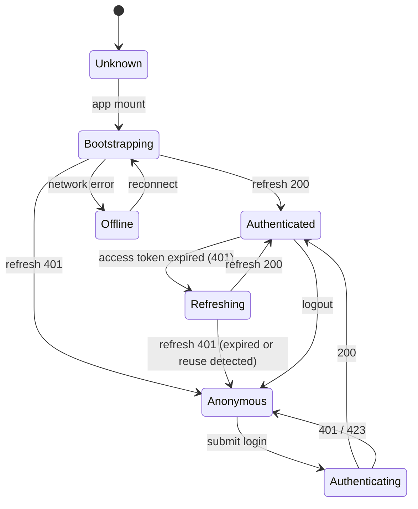
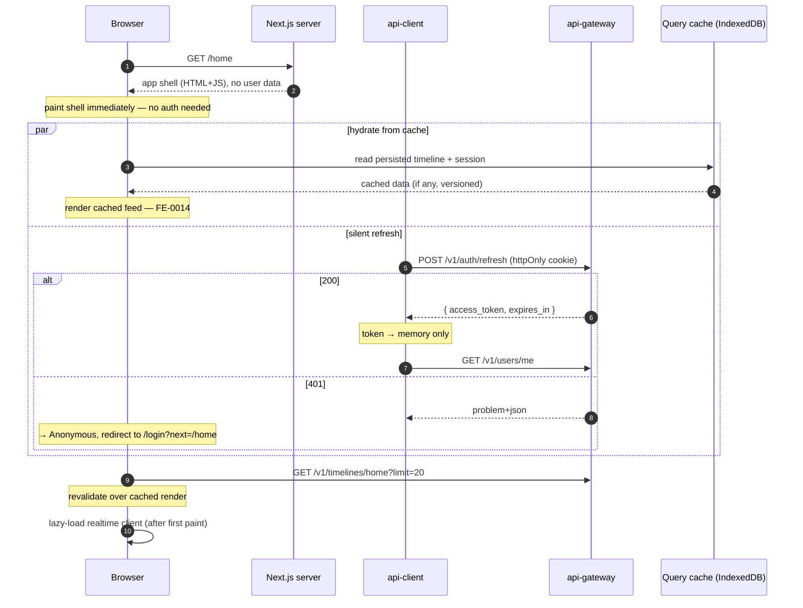
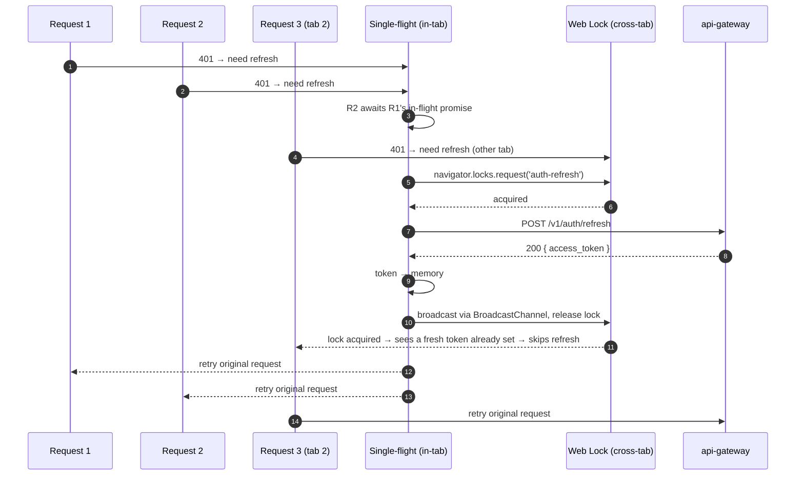
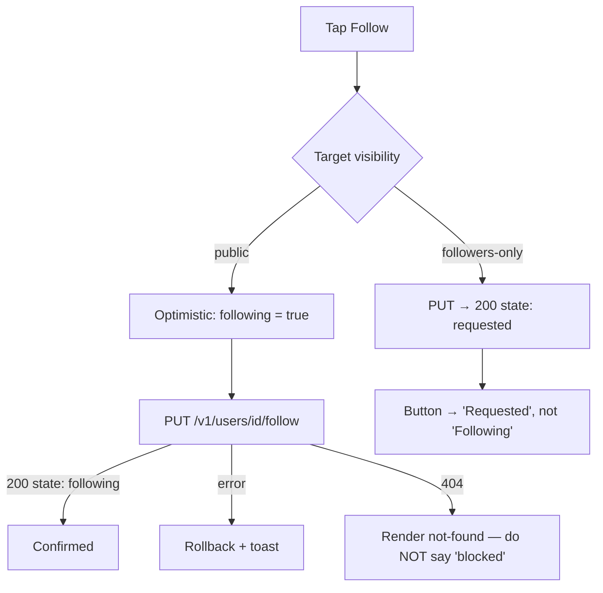
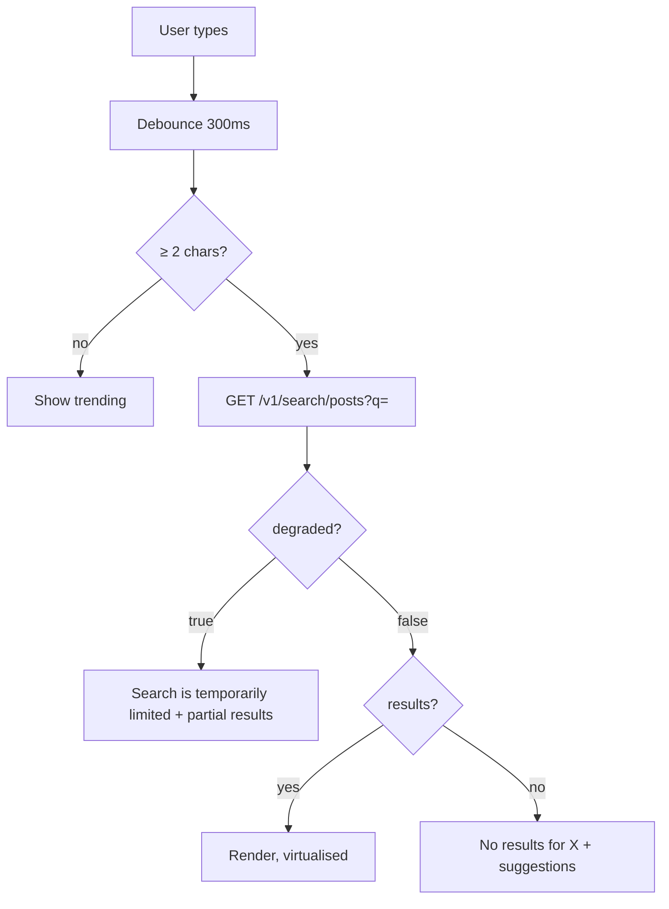
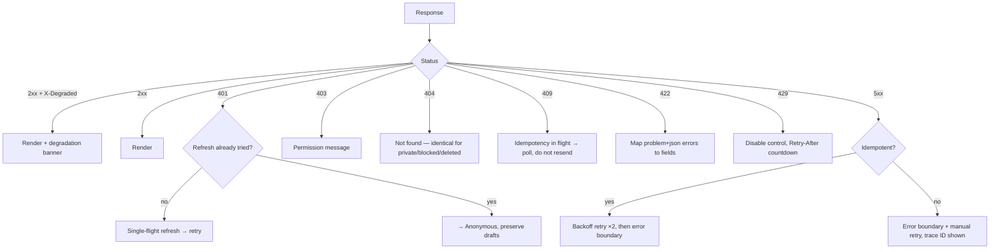
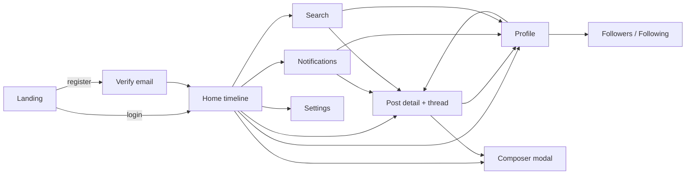

# Frontend Flows

Every flow that carries risk, specified end to end. Flows that are trivial (settings forms, static pages) are omitted deliberately — this document covers the ones where getting it wrong produces a real defect.

Backend contracts referenced throughout are from [`docs/02-components/`](../02-components/) and [`docs/03-cross-cutting/api-conventions.md`](../03-cross-cutting/api-conventions.md).

---

## Contents

1. [Session state machine](#1-session-state-machine)
2. [Cold boot](#2-cold-boot)
3. [Login and registration](#3-login-and-registration)
4. [Token refresh under concurrency](#4-token-refresh-under-concurrency) ← highest risk
5. [Home timeline: load, paginate, refresh](#5-home-timeline-load-paginate-refresh)
6. [Compose and publish](#6-compose-and-publish)
7. [Like: optimistic boolean, reconciled count](#7-like-optimistic-boolean-reconciled-count)
8. [Follow and the private-account path](#8-follow-and-the-private-account-path)
9. [Realtime notifications](#9-realtime-notifications)
10. [Search](#10-search)
11. [Logout](#11-logout)
12. [Degradation and error flows](#12-degradation-and-error-flows)
13. [Navigation map](#13-navigation-map)

---

## 1. Session state machine

Every screen's auth behaviour derives from this. There are five states and no others.



| State            | UI                                                             |
| ---------------- | -------------------------------------------------------------- |
| `Unknown`        | Nothing rendered — prevents an auth flash                      |
| `Bootstrapping`  | App shell + skeleton. **Not a spinner** — the real layout      |
| `Anonymous`      | Public routes; authenticated routes redirect to `/login?next=` |
| `Authenticating` | Submit disabled, inline progress                               |
| `Authenticated`  | Full app                                                       |
| `Refreshing`     | **Transparent.** Requests queue; no UI change                  |
| `Offline`        | Cached content readable, offline bar                           |

`Refreshing` being invisible is deliberate. A refresh happens roughly every 10 minutes of active use; surfacing it would flash a loading state during ordinary scrolling.

The `Bootstrapping → Anonymous` transition is the one to get right: it must not flash authenticated chrome first. `Unknown` renders nothing precisely to prevent that.

---

## 2. Cold boot



Three things worth calling out:

- **The shell paints before any auth work.** The Next.js response contains no user data and needs none, so first paint is not blocked on the refresh round trip.
- **Cache hydration and refresh run in parallel.** A returning user sees their previous feed at ~200 ms rather than at ~800 ms.
- **The realtime client is loaded last**, deliberately off the critical path (FE-0010).

**Cache invalidation on identity change.** After `GET /v1/users/me` returns, the client compares the user ID against the one the persisted cache was written under. On mismatch, the entire cache is dropped before rendering. Without this, a shared device shows the previous user's timeline for the first few hundred milliseconds — a privacy incident, and one that only appears on shared devices, which is to say never in development.

---

## 3. Login and registration

```mermaid
sequenceDiagram
    autonumber
    participant U as User
    participant F as Login form
    participant A as api-client
    participant G as api-gateway

    U->>F: email + password
    F->>F: Zod validation (client-side, format only)
    F->>A: POST /v1/auth/login
    A->>G: →
    alt 200
        G-->>A: { access_token, expires_in } + Set-Cookie: refresh (httpOnly)
        A->>A: token → memory
        F->>F: session → Authenticated; redirect to ?next= or /home
    else 401
        G-->>A: problem+json "invalid credentials"
        F->>U: identical message for unknown email and wrong password
    else 423 Locked
        G-->>A: problem+json + Retry-After
        F->>U: "Too many attempts. Try again in N minutes."
    else 429
        G-->>A: Retry-After
        F->>U: countdown, submit disabled
    end
```

**Anti-enumeration is a frontend responsibility too.** The backend returns byte-identical responses for unknown-email and wrong-password (`identity-service.md` §4.2). The client must not undo that: no "we don't recognise that email" hint, no client-side email-existence check, no differing field-level error placement. The form shows one message at form level for both cases.

The same applies to password reset: `POST /v1/auth/password/forgot` always returns `202`, and the UI always shows "If an account exists for that address, we've sent a link" — regardless.

### Registration

Adds one step that shapes the whole first-run experience: the backend **requires a verified email before a user may post, follow, or like** (`identity-service.md` §4.1).

```
register → 201 + session (authenticated, unverified)
        → /home renders normally, read-only
        → a persistent, non-blocking banner: "Verify your email to post"
        → composer and follow/like controls disabled with the reason attached
        → verify-email link → POST /v1/auth/verify-email → capabilities unlock
```

The unverified state is a **first-class UI state**, not an error. Users land in it for minutes or days, and treating it as an error case produces a hostile first run.

---

## 4. Token refresh under concurrency

**The highest-risk flow in the frontend.** Risk FR1.

### Why it is dangerous

The backend rotates refresh tokens and detects reuse: presenting an already-rotated token **revokes the entire session family** (`identity-service.md` §3). That is the correct security design. It also means:

> If two requests 401 at the same moment and both call `/refresh`, the second presents a token the first already rotated. The backend concludes the token was stolen, revokes everything, and the user is logged out.

Timeline scroll fires several parallel requests. Token expiry is a wall-clock event that hits all of them at once. So this does not require an unusual sequence — it is the _expected_ behaviour of a naive implementation, roughly every 10 minutes, for every active user.

It gets worse across tabs: two tabs share the cookie, so tab A refreshing invalidates tab B's next refresh even if each tab is internally single-flighted.

### The design



Three coordination layers, each necessary:

| Layer                                  | Prevents                                                                                                |
| -------------------------------------- | ------------------------------------------------------------------------------------------------------- |
| **In-tab single-flight promise**       | N parallel requests in one tab issuing N refreshes                                                      |
| **`navigator.locks` (`auth-refresh`)** | Two tabs refreshing simultaneously                                                                      |
| **`BroadcastChannel`**                 | The tab that waited for the lock refreshing anyway — it checks for a token newer than its own and skips |

After acquiring the lock, a tab re-checks whether the token has already been replaced. Without that check, tab B still refreshes after tab A finishes — the lock serialises the calls but does not prevent the second one, and serialised reuse is still reuse.

Fallback where `navigator.locks` is unavailable (older Safari): `BroadcastChannel` with a randomised 0–150 ms delay and a token-freshness re-check. Weaker, but the re-check makes the residual race harmless.

### Failure handling

| Result                    | Action                                                                                                             |
| ------------------------- | ------------------------------------------------------------------------------------------------------------------ |
| 200                       | Set token, release lock, retry all queued requests once                                                            |
| 401 (expired)             | Clear session → `Anonymous`, redirect with `?next=`, **preserve drafts**                                           |
| 401 (reuse detected)      | Same, plus a security notice: "You were signed out for your protection. If this wasn't you, change your password." |
| Network error             | Do **not** clear the session → `Offline`, retry with backoff                                                       |
| Refresh already in flight | Await the shared promise; never start a second                                                                     |

The network-error branch matters: treating a transient failure as "logged out" would sign users out every time they enter a tunnel.

### Proactive refresh

The client also refreshes at **T−60 s** before expiry rather than waiting for a 401. This avoids the concurrency scenario entirely in the common case; the reactive path remains for suspended tabs and clock skew. Both paths go through the same single-flight.

**Tests (mandatory, not optional):**

- 20 parallel requests returning 401 → exactly one `POST /refresh`.
- Two Playwright browser contexts sharing a cookie jar, both refreshing → exactly one refresh, both stay signed in.
- Refresh returns 401 mid-compose → user lands on login and the draft survives.

---

## 5. Home timeline: load, paginate, refresh

```mermaid
sequenceDiagram
    autonumber
    participant U as User
    participant T as Timeline feature
    participant Q as useInfiniteQuery
    participant G as api-gateway

    T->>Q: mount
    Q->>G: GET /v1/timelines/home?limit=20
    G-->>Q: { data[20], page:{ next_cursor, has_more } } [+ X-Degraded?]
    Q-->>T: render (virtualised)

    U->>T: scroll to ~70% of loaded height
    T->>Q: fetchNextPage()
    Q->>G: GET /v1/timelines/home?limit=20&cursor=<opaque>
    G-->>Q: next page
    Note over Q: pages appended; cursor never parsed

    loop every 60s while tab visible
        T->>G: GET /v1/timelines/home?limit=1
        alt head id ≠ known head id
            T->>U: "N new posts" pill
        end
    end

    U->>T: tap pill
    T->>Q: reset to page 1, scroll to top
```

### Non-obvious rules

**Cursors are opaque.** Never parsed, compared, or constructed. The backend reserves the right to switch to ranked pages (ADR-0016), at which point a cursor stops being a post ID. Any code that treats it as one breaks silently at that moment. A lint rule forbids string operations on cursor values.

**New posts are never auto-injected.** Prepending to a scrolled, virtualised list moves content under the user's thumb. The backend guarantees new posts appear only on a fresh page 1 (`timeline-service.md` §4) — the client honours that with an explicit pill.

**Prefetch at 70%, not at the sentinel.** Waiting until the last item is visible means the user hits a loading state on every page on a slow connection.

**`X-Degraded` surfaces.** If present, a dismissible banner names what is stale. `timeline-pull` → "Some posts may be missing"; `post-hydration` → "Some posts couldn't be loaded".

**Deep pagination is not special-cased.** The backend transparently switches from the materialised window to a deep page past entry 400 (`timeline-service.md` §4a), at higher latency. The client shows the same loading affordance. It only needs to tolerate slower pages — reflected in a longer timeout for `cursor`-bearing requests.

### Scroll restoration (risk FR3)

Back-navigation from a post detail must return to the exact scroll offset in a virtualised list.

```
on leave:  persist { pages, cursor, scrollOffset, measuredHeights } keyed by route + user
on return: hydrate query cache → restore measured heights → set scroll offset → then render
```

Restoring heights **before** scrolling is what makes it work: without cached measurements the virtualiser estimates, the estimate is wrong, and the restored offset lands somewhere else. Heights are keyed by post ID so they survive reordering.

---

## 6. Compose and publish

```mermaid
sequenceDiagram
    autonumber
    participant U as User
    participant C as Composer
    participant D as Draft store (localStorage)
    participant Q as Query cache
    participant G as api-gateway

    U->>C: open composer
    C->>D: create draft { id, idempotencyKey: uuidv4(), text: "" }
    loop typing
        U->>C: keystroke
        C->>C: grapheme count (not .length)
        C->>D: debounced 300ms persist
    end

    U->>C: Post
    C->>Q: optimistic insert (status: pending) at feed head
    C->>G: POST /v1/posts { content } + Idempotency-Key: <draft key>

    alt 201
        G-->>C: Post
        C->>Q: replace optimistic entry with the real post
        C->>D: delete draft
    else 422 validation
        G-->>C: problem+json { errors[] }
        C->>Q: remove optimistic entry
        C->>C: map field errors; draft retained
    else 5xx / network
        C->>Q: mark entry failed (inline retry)
        Note over D: draft + SAME idempotency key retained
    else 409 in-flight
        Note over C: a retry raced the first attempt — poll, do not resend
    end
```

### The three things that matter

**1. The idempotency key belongs to the draft, not the request** (FE-0009). Generated when the draft is created, persisted with it, reused across every retry — including after a crash and reload. A key generated per HTTP attempt defeats the mechanism entirely and produces duplicate posts on exactly the flaky connections it exists to protect.

**2. Character counting uses graphemes.** The backend counts graphemes (`post-service.md` §3); `"👨‍👩‍👧‍👦".length` is 11 in JavaScript and 1 to a user. Using `.length` produces a counter that disagrees with the server — rejecting text the user can see fits, or accepting text the server rejects. `Intl.Segmenter` with `granularity: 'grapheme'`.

**3. Drafts survive everything.** Persisted on every keystroke (debounced), restored on boot, and explicitly retained through auth failure, validation failure, and network failure. Draft loss is the defect users remember.

**Optimistic insert and the freshness budget.** The post is inserted at the feed head immediately. The backend's fan-out takes up to 5 s (system design §1), so a refetch inside that window would _not_ contain it. The optimistic entry is therefore held and reconciled by ID rather than removed on the next fetch — otherwise the user watches their own post vanish and reappear.

---

## 7. Like: optimistic boolean, reconciled count

The flow that demonstrates the backend's split consistency model most sharply.

```mermaid
sequenceDiagram
    autonumber
    participant U as User
    participant P as Post card
    participant Q as Query cache
    participant G as api-gateway

    U->>P: tap like
    P->>Q: viewerLiked = true              (authoritative — read-your-writes)
    P->>Q: countDelta[postId] = +1         (display overlay, NOT the count)
    Note over P: renders serverCount + delta, instantly

    P->>G: PUT /v1/posts/{id}/like
    alt 200
        G-->>P: { liked: true }
        Note over Q: boolean confirmed; delta still held
    else error
        P->>Q: rollback boolean and delta
        P->>U: toast
    end

    loop later refetches
        G-->>Q: post { like_count: <may lag up to 10s> }
        alt server count already reflects the like
            Q->>Q: clear delta
        else still stale
            Q->>Q: keep delta (ceiling 15s, then clear)
        end
    end
```

### Why not just optimistically bump the count

Because it visibly breaks. `like_count` is eventually consistent with ~10 s of lag (system design §6). Optimistically setting `count + 1` and then refetching within that window returns the _old_ count, and the number drops back in front of the user — on every like, making every like look like it failed.

Separating the two fields matches what the backend actually guarantees:

| Field        | Backend guarantee                                         | Client treatment                                              |
| ------------ | --------------------------------------------------------- | ------------------------------------------------------------- |
| `liked`      | Read-your-writes — the `likes` row is the source of truth | Optimistic, authoritative, rolled back on error               |
| `like_count` | Eventually consistent, approximate                        | Never written optimistically; a delta is overlaid for display |

The delta clears when the server value moves in the expected direction, or after a 15-second ceiling — so a permanently stale count self-heals rather than compounding.

`PUT` and `DELETE` are used rather than `POST` (`api-gateway.md` §3), so retries are free and no idempotency key is needed. Rapid tap-toggling is debounced to the final state and sent once.

Reposts follow the identical pattern. Follow does too, for `follower_count`.

---

## 8. Follow and the private-account path



Two points:

**`state` is `'following'` or `'requested'`** (`graph-service.md` §3), and the button must reflect which. Optimistically showing "Following" for a private account and correcting to "Requested" is a visible lie, so the optimistic update for a known-private target goes straight to "Requested".

**A `404` on follow means blocked** — and must render as generic not-found. The backend returns `404` rather than `403` specifically so a blocked user cannot detect the block by probing (`graph-service.md` §3). A UI that says "you have been blocked" reintroduces the leak through the front door.

---

## 9. Realtime notifications

```mermaid
sequenceDiagram
    autonumber
    participant A as App (authenticated, first paint done)
    participant G as api-gateway
    participant R as realtime-gateway
    participant Q as Query cache

    A->>G: POST /v1/realtime/ticket
    G-->>A: { ticket, expires_in: 30 }
    A->>R: WSS /v1/realtime?ticket=…
    R-->>A: { t:"ready", d:{ since } }
    A->>A: store since as the replay cursor

    R-->>A: { t:"notification", d:{ id, type, actor, entity } }
    A->>A: seen.has(id)? drop : add            ← at-least-once ⇒ dedupe
    A->>Q: prepend to ['notifications'] ; increment unread
    A->>R: { t:"ack", d:{ id } }

    Note over A,R: disconnect (network / deploy / 4408)
    A->>A: exponential backoff + full jitter
    A->>G: POST /v1/realtime/ticket        ← new ticket, never reuse the URL
    A->>R: WSS …?ticket=…
    A->>R: { t:"subscribe", d:{ since: lastSeenId } }
    R-->>A: replay of missed notifications
```

### Rules

| Rule                                   | Reason                                                                                                           |
| -------------------------------------- | ---------------------------------------------------------------------------------------------------------------- |
| Dedupe by notification ID              | Delivery is at-least-once (`realtime-gateway.md` §4); duplicates are expected, not exceptional                   |
| Re-ticket on every reconnect           | Tickets are single-use and 30 s (`realtime-gateway.md` §2) — replaying the URL always fails                      |
| Backoff with **full jitter**, cap 30 s | A deploy drops 20K connections at once; synchronised retry is a self-inflicted DDoS                              |
| Distinguish close codes                | `4401`/`4403` → session problem, re-auth. `1012` → server restart, reconnect. `4429` → back off hard             |
| Socket is lazy                         | Loaded after first paint; never blocks interactivity (FE-0010)                                                   |
| Poll fallback                          | If the socket fails twice, poll `/v1/notifications` every 60 s; both paths merge through the same cache function |
| Pause when hidden                      | `visibilitychange` → close after 5 min hidden; reconnect with `since` on return                                  |

The **same merge function** handles socket-delivered and poll-delivered notifications. That makes duplicate handling uniform and means the fallback path cannot drift from the primary one.

Unread count comes from the server (`GET /v1/notifications/unread-count`) and is incremented locally on push, with the server value as the reconciliation source — the same delta pattern as §7.

---

## 10. Search



**`degraded: true` is not "no results".** The backend returns empty results with a degraded flag when Elasticsearch is unavailable (`search-service.md` §7) rather than failing the request. Rendering that as "No results found" tells the user their query has no matches — a confident, wrong answer. It must read as a temporary system limitation.

Debounce at 300 ms, cancel in-flight requests on new input, and cache per normalised query for 30 s. The backend's search rate limit is 30/min per user (`api-gateway.md` §4) — a naive per-keystroke implementation would exhaust that in twelve seconds of typing.

Search results are hydrated by the gateway, so they arrive as full posts and reuse the same card component and the same like/repost flows.

---

## 11. Logout

```
POST /v1/auth/logout
  → clear access token from memory
  → server clears the refresh cookie
  → queryClient.clear()
  → drop the persisted IndexedDB cache        ← FE-0014; privacy-critical
  → clear Zustand stores except theme
  → close the WebSocket
  → keep nothing user-scoped in localStorage
  → redirect to /
```

Fire-and-forget on the network call: if `POST /logout` fails, the client still clears everything locally and redirects. A user who taps "log out" must end up logged out regardless of connectivity; the server-side session expires on its own.

**Dropping the persisted cache is not optional.** Skipping it leaves a full timeline in IndexedDB, readable by the next person to open the app on that device.

"Log out everywhere" calls `POST /v1/auth/logout-all` and additionally broadcasts to other tabs via `BroadcastChannel` so they clear immediately rather than at their next 401.

---

## 12. Degradation and error flows



### Principles

**Errors are scoped to a region, never a page.** A failed unread count must not blank the feed. Error boundaries wrap features.

**The trace ID is always shown** on unrecoverable errors — the backend puts it in every `problem+json` body (`api-conventions.md` §2) precisely so support can turn a user report into a single trace lookup. Presented as small, copyable text.

**404 renders identically** for private accounts, blocked users, and deleted posts. The backend deliberately conflates them; distinguishing them in the UI reintroduces the enumeration leak the backend closed.

**Rate limits are respected proactively.** Every response carries `RateLimit-Remaining` (`api-conventions.md` §9). Below 10% remaining, the client throttles background polling and warns before a hard block, rather than discovering the limit with a 429.

---

## 13. Navigation map



### Journeys and their success criteria

| Journey                   | Steps                                                          | Success                                              |
| ------------------------- | -------------------------------------------------------------- | ---------------------------------------------------- |
| **First post**            | register → verify → compose → publish → see it in own timeline | < 90 s total, no lost input                          |
| **Return visit**          | open → cached feed painted → revalidated                       | Content visible < 1.0 s                              |
| **Discover and follow**   | search → profile → follow → their posts appear in the feed     | Follow reflected instantly; posts within one refresh |
| **Notification response** | push → tap → post detail → reply                               | < 3 s from push to detail                            |
| **Share**                 | copy link → open in a logged-out browser                       | SSR page with OG preview, < 2.0 s                    |

The last one is the growth loop and the reason for FE-0001's SSR half. It is measured on every release, because it is the one journey a logged-in developer never exercises by accident.
