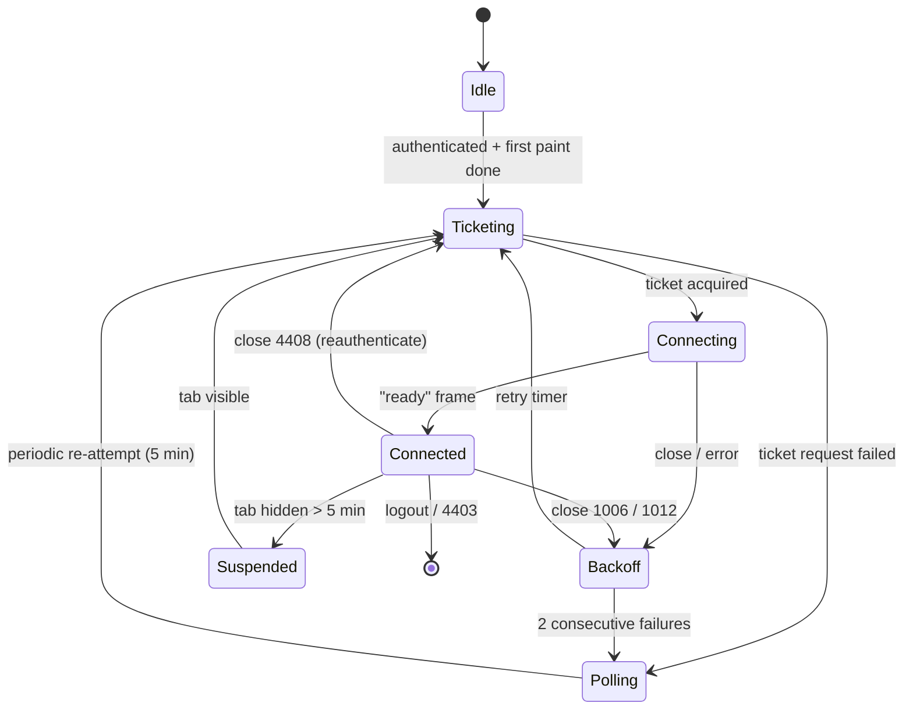

# Module — `realtime`

**Responsibility:** WebSocket lifecycle, ticket acquisition, reconnection, deduplication.
**Depends on:** `api-client` (ticket endpoint), `lib/telemetry`
**Consumed by:** `data/` via typed events — **never touches the query cache directly**

Backend contract: [`realtime-gateway.md`](../../02-components/realtime-gateway.md).

---

## 1. Position in the architecture

Realtime is an **enhancement, never a dependency** (FE-0010). Notifications work at a 60-second poll without it; the socket takes that to under a second.

This mirrors the backend's own stance — `realtime-gateway.md` §6 states that a total failure of the component degrades notification latency and loses nothing, because Postgres holds the record. A client that treats the socket as required would be strictly less reliable than the system it runs on.

Practical consequences: the module is **lazy-loaded after first paint**, it is never on the critical path, and every code path has a polling equivalent.

---

## 2. Connection lifecycle



`Polling` is a real state, not an error state — it has its own indicator and its own retry cadence.

---

## 3. Ticket exchange

Browsers cannot set an `Authorization` header on a WebSocket handshake, and a token in the query string leaks into access logs, referrers, and proxy caches. The backend therefore issues a single-use 30-second ticket (`realtime-gateway.md` §2).

```ts
async function connect() {
  const { ticket } = await api.realtime.issueTicket();      // Bearer-authenticated HTTP
  const ws = new WebSocket(`${WS_URL}/v1/realtime?ticket=${encodeURIComponent(ticket)}`);
  ...
}
```

**A new ticket is required for every connection attempt.** Tickets are consumed atomically by `GETDEL` server-side, so replaying a URL always fails — including the retry immediately after a dropped connection. Caching the socket URL is the most natural mistake here and produces a client that can connect exactly once.

---

## 4. Reconnection

```ts
const BACKOFF = {
  base: 1_000,
  max: 30_000,
  factor: 2,
  jitter: 'full',
} as const;

function nextDelay(attempt: number) {
  const ceiling = Math.min(
    BACKOFF.max,
    BACKOFF.base * BACKOFF.factor ** attempt,
  );
  return Math.random() * ceiling; // full jitter — not ceiling/2, not ceiling
}
```

**Full jitter is not a refinement here, it is the requirement.** A backend deploy closes up to 20,000 connections per instance in staggered batches (`realtime-gateway.md` §5). If every client reconnects on a fixed schedule, the reconnect wave is a self-inflicted denial of service against the instances that survived — turning a routine rollout into an outage. Randomising the full interval spreads the load flat.

### Close-code handling

| Code          | Meaning                              | Action                                                          |
| ------------- | ------------------------------------ | --------------------------------------------------------------- |
| `1000`        | Normal                               | No reconnect                                                    |
| `1001`/`1006` | Going away / abnormal                | Backoff reconnect                                               |
| `1012`        | Server restart (deploy)              | Backoff reconnect — **expect a crowd**                          |
| `4401`        | Ticket invalid/expired               | Re-ticket immediately (once), then backoff                      |
| `4403`        | Session revoked                      | **Stop.** Trigger session re-check — the user may be logged out |
| `4408`        | Reauthenticate (12 h connection age) | Re-ticket, reconnect — routine, invisible                       |
| `4409`        | Connection limit (6th tab)           | Do not reconnect; fall back to polling                          |
| `4429`        | Rate limited                         | Long backoff, then polling                                      |

Conflating `4403` (you are logged out) with `4408` (get a new ticket) produces either an infinite reconnect loop against a revoked session, or a spurious logout during a routine 12-hour refresh. They must be handled separately.

---

## 5. Delivery and deduplication

```ts
const seen = new LRUSet<string>(500); // bounded — a Set would grow forever

function onMessage(raw: MessageEvent) {
  const frame = parseFrame(raw.data); // validated; malformed frames are dropped + counted
  switch (frame.t) {
    case 'ready':
      cursor = frame.d.since;
      emit({ type: 'connected', since: cursor });
      break;
    case 'notification':
      if (seen.has(frame.d.id)) {
        metrics.dupe++;
        return;
      } // at-least-once ⇒ expected
      seen.add(frame.d.id);
      cursor = frame.d.id;
      emit({ type: 'notification', payload: frame.d });
      send({ t: 'ack', d: { id: frame.d.id } });
      break;
    case 'unread':
      emit({ type: 'unread', count: frame.d.count });
      break;
    case 'pong':
      lastPong = Date.now();
      break;
  }
}
```

**Duplicates are expected, not exceptional.** Delivery is at-least-once and a reconnect replays from the cursor, so the same notification legitimately arrives twice. The `seen` set is LRU-bounded: an unbounded `Set` in a session that stays open for days is a slow memory leak.

### Catch-up

```ts
// on reconnect
send({ t: 'subscribe', d: { since: cursor } }); // server replays via XRANGE
```

The cursor is the last notification ID seen, persisted to `sessionStorage` so a reload within a session resumes rather than restarts. Beyond the server's 200-entry stream window, replay is incomplete — so on reconnect the client also invalidates the notifications query, letting the paginated HTTP endpoint fill any gap. Belt and braces, because the stream is a delivery buffer and Postgres is the record.

### Heartbeat

Application-level `ping`/`pong` every 30 s; no `pong` within 10 s closes and reconnects. Protocol-level ping frames are frequently dropped by intermediary proxies, so a connection can appear open while being dead — the failure mode that produces "notifications just stopped working" reports.

---

## 6. Lifecycle integration

| Event                                | Behaviour                                                 |
| ------------------------------------ | --------------------------------------------------------- |
| Authenticated + first paint complete | Lazy-import the module, connect                           |
| Tab hidden                           | Keep the connection for 5 min, then close (battery)       |
| Tab visible                          | Reconnect with `since`; invalidate notifications          |
| `online`                             | Immediate reconnect attempt, resetting backoff            |
| `offline`                            | Close cleanly; do not retry until `online`                |
| Logout                               | Close with `1000`; clear cursor and `seen`                |
| Multiple tabs                        | Each tab holds its own connection (backend allows 5/user) |

Per-tab connections rather than a `SharedWorker`: the backend explicitly supports five concurrent connections per user, `SharedWorker` support is uneven, and cross-tab message routing adds a failure mode for a benefit the backend already absorbed.

The 5-minute hidden-tab timeout matters on mobile, where a background socket keeps the radio active and is a visible battery cost.

---

## 7. Polling fallback

```ts
function startPolling() {
  connectionStatus.set('polling');
  interval = setInterval(() => {
    queryClient.invalidateQueries({ queryKey: keys.notifications() });
    queryClient.invalidateQueries({ queryKey: keys.notificationsUnread() });
  }, 60_000);
  setTimeout(tryUpgradeToSocket, 5 * 60_000); // periodically attempt to recover
}
```

Entered after two consecutive connection failures, on `4409`/`4429`, or where WebSocket is unavailable. Both paths converge on the same cache-merge function in `data/` (§6 of [`data-layer.md`](./data-layer.md)), so duplicate handling is uniform and the fallback cannot drift from the primary path.

60 seconds is chosen against the backend's general read limit (1,000/hour, `api-gateway.md` §4): 60 polls/hour is well within budget alongside normal use.

---

## 8. Event interface

```ts
type RealtimeEvent =
  | { type: 'connected'; since: string }
  | { type: 'disconnected'; code: number }
  | { type: 'notification'; payload: Notification }
  | { type: 'unread'; count: number }
  | {
      type: 'status';
      status: 'connected' | 'reconnecting' | 'polling' | 'offline';
    };

export function subscribe(fn: (e: RealtimeEvent) => void): () => void;
```

The module knows nothing about React, TanStack Query, or notification rendering. It emits typed events; `data/` decides what they mean. That keeps it unit-testable against a mock socket with no framework in the loop.

---

## 9. Observability

```
realtime_connection_state{state}          gauge
realtime_reconnect_total{code}            counter
realtime_duplicate_frames_total           counter   ← at-least-once working as designed
realtime_delivery_latency_ms              histogram (server ts → render)
realtime_fallback_activations_total       counter
realtime_malformed_frames_total           counter   ← protocol drift with the backend
```

`realtime_delivery_latency_ms` is the client half of the backend's "notification delivery p99 < 3 s" SLO (`observability-and-slo.md` §1). Without it, that SLO is measured only up to the socket write and stops short of the user.

A rising `realtime_malformed_frames_total` is the earliest signal that the backend's protocol has changed under us.

---

## 10. Testing

| Test                       | Asserts                                                |
| -------------------------- | ------------------------------------------------------ |
| Ticket → connect → `ready` | Happy path                                             |
| Reconnect                  | **A new ticket is fetched**, not the old URL replayed  |
| Duplicate notification ID  | Emitted once                                           |
| Reconnect with `since`     | Missed notifications replayed, nothing duplicated      |
| `4403`                     | Stops reconnecting, triggers session re-check          |
| `4408`                     | Re-tickets silently, no user-visible change            |
| Two consecutive failures   | Falls back to polling                                  |
| Backoff distribution       | Full jitter — 100 simulated clients do not synchronise |
| Tab hidden 6 min           | Connection closed                                      |
| Missing `pong`             | Connection closed and re-established                   |
| Malformed frame            | Dropped and counted, no crash                          |
| Logout                     | Socket closed, cursor and `seen` cleared               |

Playwright covers the multi-tab case: two tabs, one notification, both receive it, neither duplicates.
